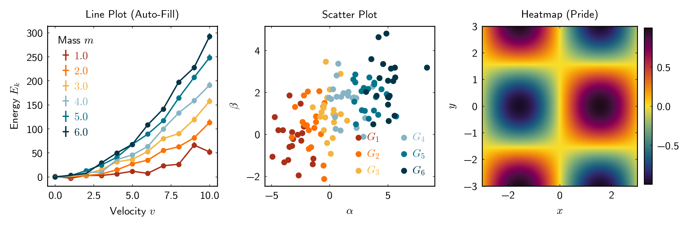

<div align="center">

# 🧪 Minimalist
### A clean, production-grade Matplotlib style for scientific figures.

[](https://www.python.org/downloads/)
[](LICENSE)
[](https://github.com/surajinacademia/Matplolib-Minimalist-Theme/actions)

[Features](#-features) • [Installation](#-installation) • [Quick Start](#-quick-start) • [Visual Demos](#-visual-demos) • [Development](#-development)

</div>

---

## ✨ Features

- **🏛️ White and Black Styles**: Clean, publication-ready defaults for light and dark backgrounds.
- **🎨 Modern Colormaps**:
    - **Diverging**: `pride` (via `scicomap`)
    - **Sequential**: `inferno`
    - **Qualitative**: Custom `BASE_COLORS`
- **⬜ Square Plots**: Enforces square aspect ratios by default for professional consistency.
- **🔡 Typography**: Integrated **CMU Sans Serif** with Computer Modern math notation and 8 pt publication text defaults (no LaTeX required).
- **📏 Perfect Sizing**: Figure width constants based on standard LaTeX article text width (510pt).

---

## 🖼️ Visual Demos

<p align="center">
  
</p>

---

## 🚀 Installation

```bash
# Clone the repository
git clone https://github.com/surajinacademia/Matplolib-Minimalist-Theme.git
cd Matplolib-Minimalist-Theme/packages/minimalist

# Install in editable mode
pip install -e .
```

---

## 🛠️ Quick Start

```python
import minimalist
import matplotlib.pyplot as plt
import numpy as np

# Apply the default white style
minimalist.use_style('white')

# Or use the black-background style
# minimalist.use_style('black')

# Create a square figure using the width constants
fig, ax = plt.subplots(figsize=minimalist.figsize(0.5))

# Plot data
x = np.linspace(0, 10, 100)
y = np.sin(x)
ax.plot(x, y, label='Data')

ax.set_xlabel(r'$x$')
ax.set_ylabel(r'$\sin(x)$')
ax.legend()
plt.show()
```

---

## 📖 Professional API

### 🌈 Colormaps
```python
# Recommended way to get colormaps
diverging_cmap = minimalist.get_cmap('diverging')  # 'pride'
sequential_cmap = minimalist.get_cmap('sequential')  # 'inferno'
colors = minimalist.get_cmap('qualitative')  # List of HEX colors
```

### 📏 Figure Sizing
Based on standard LaTeX article text width (510pt = 7.06 inches).
By default, `figsize()` returns a **square** plot.

| Constant | Value | Description |
|----------|-------|-------------|
| `FW` | 7.06" | Full text width |
| `FW_2` | 3.53" | Half width (for 2-column layouts) |
| `FW_3` | 2.36" | Third width (for 3-column layouts) |
| `FW_4` | 1.77" | Quarter width |

---

## 🏗️ Development

This package uses a professional `src` layout and standard tooling.

### Tooling
- **⚙️ Testing**: `pytest`
- **🔍 Linting**: `ruff`
- **✨ Formatting**: `black`

### Common Commands
A `Makefile` is provided for convenience:

```bash
make install    # Install with development dependencies
make test       # Run the test suite
make lint       # Check for linting issues
make format     # Auto-format the codebase
make build      # Build the wheel and source distribution
```

---

## 📄 License

MIT License - see [LICENSE](LICENSE) for details.
